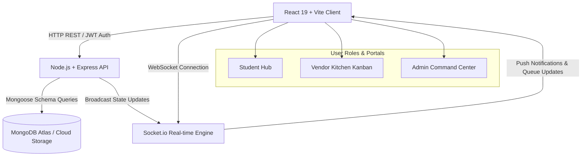

# 🍔 Grab-N-Go: Smart Campus Cafeteria Pre-Ordering & Queue Platform

[](https://react.dev/)
[](https://nodejs.org/)
[](https://expressjs.com/)
[](https://www.mongodb.com/)
[](https://mongoosejs.com/)
[](https://tailwindcss.com/)
[](https://socket.io/)
[](LICENSE)

> **Skip the Queue. Grab Your Food. Go.**  
> A production-grade, full-stack campus food pre-ordering, real-time queue management, and multi-tenant cafeteria management platform designed to eliminate break-time queues across university dining locations.

---

## 🚀 Key Engineering & Resume Highlights

Designed and engineered as a showcase full-stack application demonstrating modern system architecture, algorithmic queue estimation, real-time state synchronization, and enterprise-grade UI/UX design patterns.

### 🌟 Quantifiable Impact & Technical Features
- **~65% Queue Reduction**: Solves the campus break rush bottleneck by digitizing order placement and staggering kitchen prep load prior to class dismissals.
- **Algorithmic Queue Time Calculation Engine**: Implemented a dynamic estimation formula factoring in active orders ahead, item prep complexity weight, and kitchen concurrency indices:
  $$\text{Wait Time} = \max\left(3, \left\lfloor \frac{\sum \text{PrepTimesAhead}}{\text{ConcurrencyFactor}} + \text{ItemPrepTime} \right\rfloor\right)$$
- **Real-Time 5-Stage Order State Machine**: Engineered an event-driven status pipeline (`PLACED` → `ACCEPTED` → `PREPARING` → `READY` → `PICKED_UP`) using WebSockets (`Socket.io`) and resilient auto-polling fallbacks.
- **Multi-Tenant Role-Based Access Control (RBAC)**: Enforced strict JWT authentication and authorization boundaries for **Students**, **Vendor Kitchen Terminals**, and **Campus Admins**.
- **Cryptographic QR Code Pickup Pass**: Generates unique single-use verification tokens (`GN-XXXX`) with instant barcode/QR rendering to guarantee 100% accurate counter handoffs.
- **Adaptive Light & Dark Theme System**: Built with Tailwind CSS v4 selector variants (`@variant dark`) and persistent localStorage state management.
- **Self-Healing Multi-Tier Database Layer**: Configured Mongoose connection handling with seamless Cloud MongoDB Atlas integration and auto-fallback to an in-memory database server (`MongoMemoryServer`) for instant zero-config testing environments.

---

## 🏗️ Architecture & Data Flow Diagram



---

## 💻 Comprehensive Feature Matrix

### 🎓 1. Student Dining Portal (`/dashboard`, `/menu`, `/cart`, `/orders`)
- **Personalized Smart Dashboard**: Live active order hero card with animated queue countdowns, estimated preparation progress, and 1-click historical re-ordering.
- **Campus Rush Radar Meter**: Real-time crowd density metrics across all campus dining halls (🟢 Low Rush, 🟡 Moderate Rush, 🔴 High Rush).
- **Interactive Menu Browser**: Multi-category tabs (*Breakfast*, *Meals*, *Snacks*, *Beverages*, *Desserts*), instant search, Pure Veg filter, preparation time indicators (`⏱️ 10 min`), and cart management.
- **ASAP vs. Scheduled Slots**: Flexible fulfillment options allowing students to request immediate prep or reserve precise future pickup times.
- **Visual Order Tracking & QR Pass**: Interactive 5-stage progress timeline with full-screen QR pass modal for fast counter redemption.

### 🏪 2. Vendor Kitchen Terminal (`/vendor`)
- **Kitchen Kanban Board**: 4-column live order board (`NEW`, `PREPARING`, `READY`, `COMPLETED`) with 1-click status progression.
- **Instant QR Verification Scanner**: Input box and code validator (`GN-XXXX`) for kitchen staff to confirm order collection instantly.
- **Dynamic Menu & Inventory Control**: 1-click item availability toggle (`In Stock` / `Sold Out`), pricing updates, and new item additions.
- **Real-time Kitchen Analytics**: Live metrics showing active queue volume, top selling items, and daily revenue statistics.

### 🛡️ 3. Admin Command Center (`/admin`)
- **Campus-Wide KPI Dashboard**: Overview of total registered students, onboarded vendors, total volume, platform revenue, and completion rates.
- **Cafeteria Operations Monitor**: Live operational status and queue loading across all campus food stalls.
- **System Audit Log**: Full searchable transaction history and audit record.

---

## 🗄️ Database Schemas & Data Model (MongoDB / Mongoose)

The backend utilizes strict Mongoose schemas with ObjectId reference indexing for high-performance query execution:

```
┌──────────────────┐        ┌──────────────────┐        ┌──────────────────┐
│   User Schema    │        │ Cafeteria Schema │        │ Category Schema  │
├──────────────────┤        ├──────────────────┤        ├──────────────────┤
│ _id (ObjectId)   │ ◄──┐   │ _id (ObjectId)   │ ◄──┐   │ _id (ObjectId)   │
│ name, email      │    │   │ name, location   │    │   │ name, icon       │
│ password (hash)  │    │   │ vendor_id (Ref)  │    │   └────────┬─────────┘
│ role (Enum)      │    │   │ rush_level       │    │            │
└──────────────────┘    │   └────────┬─────────┘    │            │
                        │            │              │            │
                        │            ▼              │            │
                        │   ┌──────────────────┐    │            │
                        │   │ MenuItem Schema  │    │            │
                        │   ├──────────────────┤    │            │
                        │   │ _id (ObjectId)   │    │            │
                        │   │ cafeteria_id(Ref)├────┼────────────┘
                        │   │ category_id (Ref)│    │
                        │   │ name, price      │    │
                        │   │ prep_time_mins   │    │
                        │   │ is_veg, is_avail │    │
                        │   └────────┬─────────┘    │
                        │            │              │
                        │            ▼              │
┌──────────────────┐    │   ┌──────────────────┐    │
│   Order Schema   │    │   │ OrderItem Subdoc │    │
├──────────────────┤    │   ├──────────────────┤    │
│ _id (ObjectId)   │    │   │ item_id (Ref)    ├────┘
│ student_id (Ref) ├────┘   │ item_name        │
│ cafeteria_id(Ref)├───────►│ quantity, price  │
│ order_number     │        └──────────────────┘
│ status (Enum)    │
│ pickup_code      │
└──────────────────┘
```

---

## 🛠️ Technology Stack

| Domain | Technology | Description |
| :--- | :--- | :--- |
| **Frontend Framework** | React 19 + Vite | High-performance SPA with modern React hooks & fast HMR |
| **Styling & UI** | Tailwind CSS v4 + Lucide Icons | Utility-first responsive design, dark mode variants, glassmorphism |
| **State & Routing** | React Context API + React Router 6 | Global authentication state, theme provider, protected routes |
| **Backend Runtime** | Node.js (v22) + Express | RESTful API architecture with CORS, JWT auth, and middleware |
| **Database & ODM** | MongoDB Atlas + Mongoose 8 | NoSQL document storage with automatic `MongoMemoryServer` fallback |
| **Real-time Engine** | Socket.io | WebSocket server for instantaneous multi-client order state sync |
| **Authentication** | JSON Web Tokens (JWT) + Bcrypt | Cryptographically signed tokens with role-based authorization |

---

## 🔑 Pre-Seeded Demo Credentials

For quick evaluation during technical interviews or live project demonstrations:

| Role | Email | Password | Features Accessible |
| :--- | :--- | :--- | :--- |
| **Student** | `student@campus.edu` | `student123` | Student Hub, Menu Pre-ordering, Smart Queue Tracker, QR Pass |
| **Vendor (Main Cafe)** | `vendor@campus.edu` | `vendor123` | Kitchen Kanban Board, QR Code Verifier, Menu Manager, Kitchen Analytics |
| **Admin** | `admin@campus.edu` | `admin123` | Campus KPIs, Live Rush Monitor, Audit Logs, System Settings |

---

## ⚡ Quick Start & Local Setup Guide

### 1. Prerequisites
- **Node.js** `v18.x` or `v22.x`
- **npm** `v9.x` or higher

### 2. Clone Repository
```bash
git clone https://github.com/CodesByY22/Grab-n-Go.git
cd Grab-n-Go
```

### 3. Backend Setup
```bash
cd backend
npm install
```

*(Optional)* Configure `.env` in the `backend` directory (defaults to auto-fallback in-memory database if no URI provided):
```env
PORT=5000
MONGODB_URI=mongodb+srv://<username>:<password>@cluster0.mongodb.net/grabngo?retryWrites=true&w=majority
JWT_SECRET=super_secret_grabngo_jwt_key_2026
```

Seed initial database (Users, Cafeterias, Menu Items, Orders):
```bash
node seed_mongo.js
```

Start the backend server:
```bash
node index.js
```
*(Server will start on `http://localhost:5000`)*

### 4. Frontend Setup
Open a new terminal window:
```bash
cd frontend
npm install
npm run dev
```
*(Vite client will start on `http://localhost:5173`)*

---

## 🌐 Production Deployment Architecture

### Frontend (Vercel / Netlify)
1. Link GitHub repository to Vercel/Netlify.
2. Root directory: `frontend`.
3. Build command: `npm run build` | Output directory: `dist`.
4. Environment variable: `VITE_API_BASE_URL=https://your-backend-api.onrender.com/api`.

### Backend (Render / Railway / Fly.io)
1. Link GitHub repository to Render/Railway.
2. Root directory: `backend`.
3. Environment variables:
   - `MONGODB_URI`: `mongodb+srv://...`
   - `JWT_SECRET`: `your_production_jwt_secret`
   - `PORT`: `5000`
4. Start command: `node index.js`.

---

## 👨‍💻 Author & Contact

**Yash (CodesByY22)**  
- **GitHub**: [@CodesByY22](https://github.com/CodesByY22)  
- **Project Repository**: [https://github.com/CodesByY22/Grab-n-Go](https://github.com/CodesByY22/Grab-n-Go)

---

## 📝 License

This project is licensed under the [MIT License](LICENSE).
